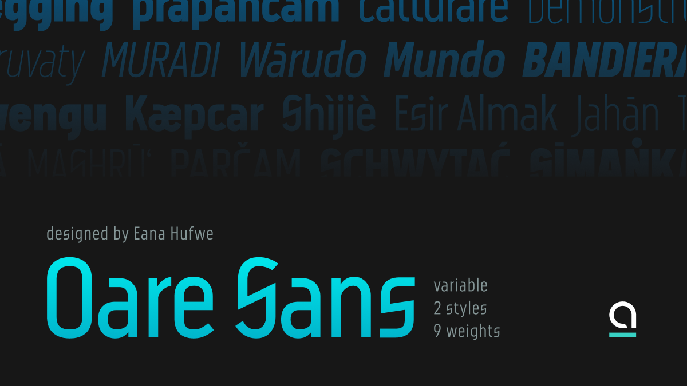
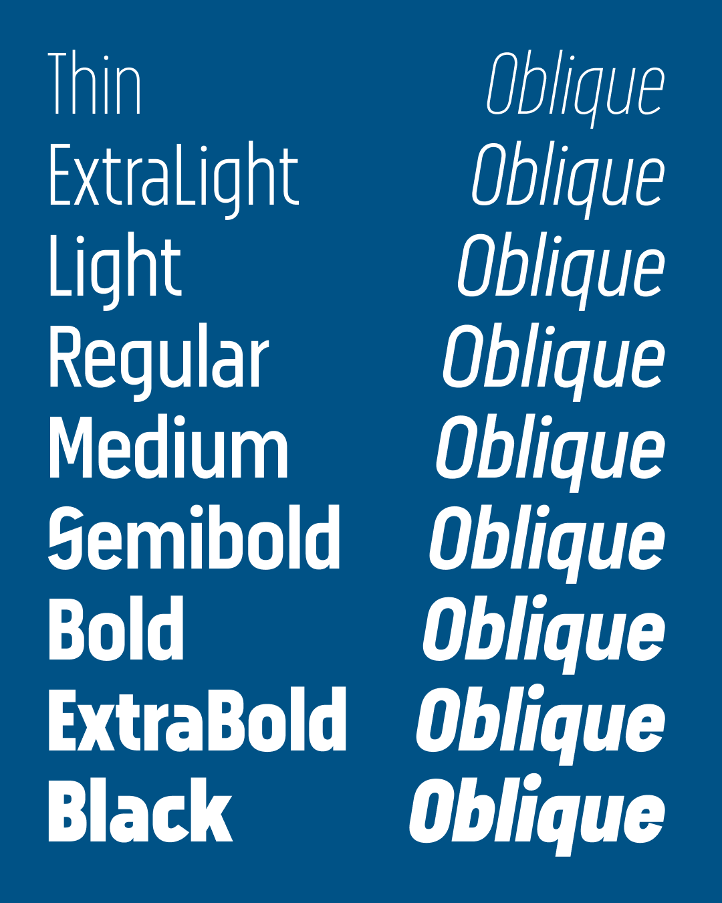
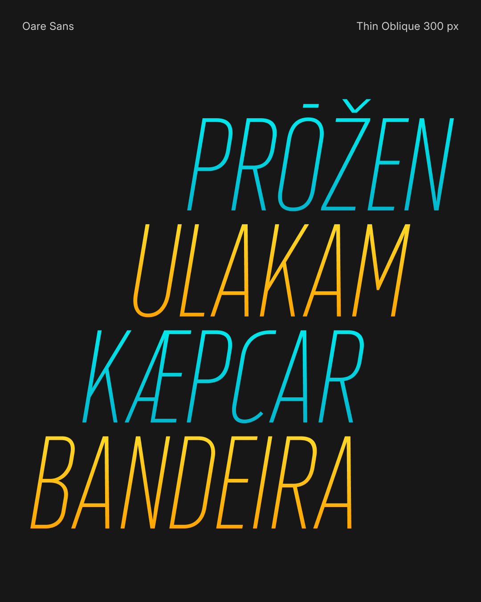
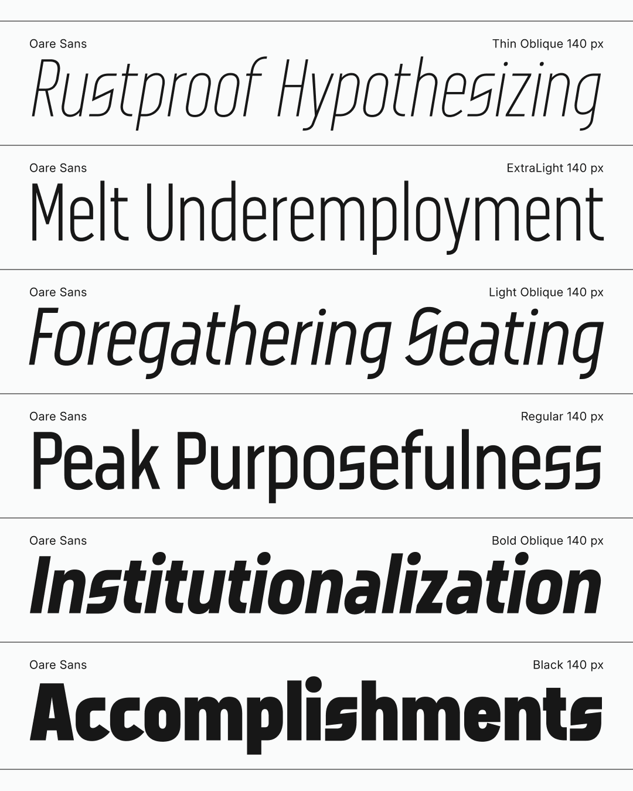
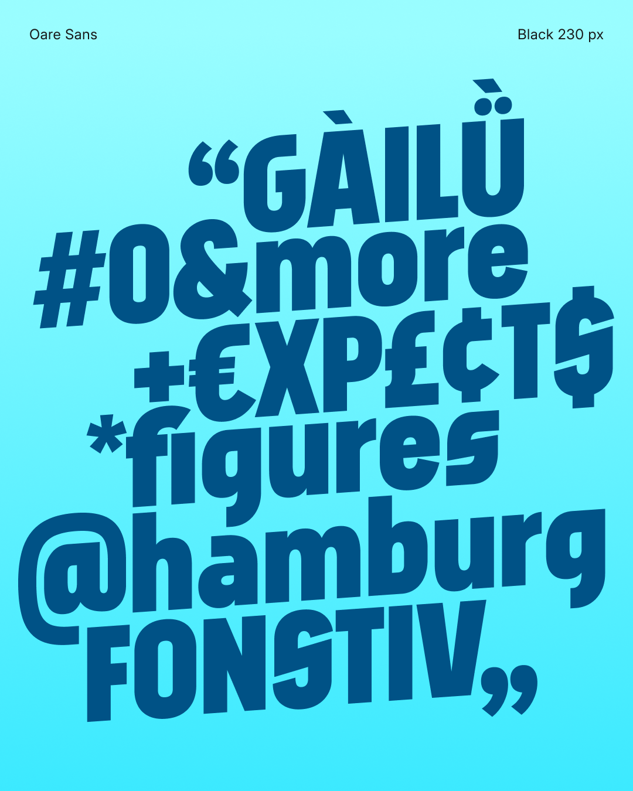
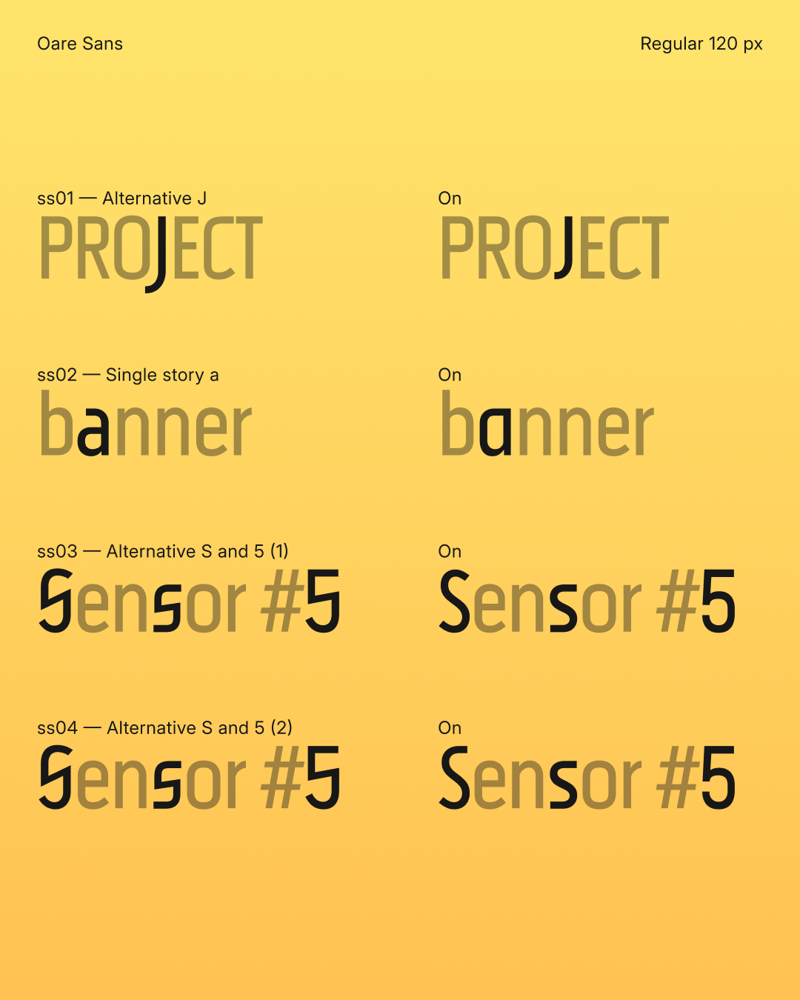

# Oare Sans

<!-- Version begin -->Version 0.002<!-- Version end -->

> **oare** *n.* [o.ˈa.ɾɛ] moon

**Oare Sans** is a condensed geometric display sans-serif typeface with variable axes for weight and slant. This typeface is an expansion of the [custom logotype created for PSCTF][psctf] from a limited set of letters to cover the GF Latin Core character set, and with variable expansion from Thin to Black and Regular to Oblique. This design was initiated from the desire to create a typeface that would match the initial design of the unconventional letter shapes of S and C. The name “Oare” is also named after the [Luna CTFd theme][luna] commissioned by the same team.

[psctf]: https://1a23.com/works/design/project-sekai-ctf/
[luna]: https://1a23.com/works/open-source/luna-for-ctfd/

## Download

* [Variable Font](./fonts/variable/)
  * `OareSans-Regular-VF`: Default flavor
  * `OareSans[slnt,wght]`: Google Fonts flavor with metadata optimized for Google Fonts
* [Static TTF](./fonts/ttf/)
* [Static OTF](./fonts/otf/)
* [Static WOFF2](./fonts/woff2/)

## Changelog

- v0.002:
  - Adjusted the contour of `/C` in oblique styles.
  - Simplified the contour of `/circumflexcomb`, `/caroncomb`, and `/g_j.liga`.
  - Added `ss02` (Single story `/a/`), `ss03` (Alternative `/S` `/s` `/five` #1), and `ss04` (Alternative `/S` `/s` `/five` #2) stylistic sets.
- v0.001: Initial test release.

## License

> Copyright (c) 2026 Eana Hufwe, 1A23 Studio (https://1A23.studio)
> 
> This Font Software is licensed under the SIL Open Font License, Version 1.1.
> This license is in this repo LICENSE.md, and is also available with a FAQ at:
> https://openfontlicense.org
